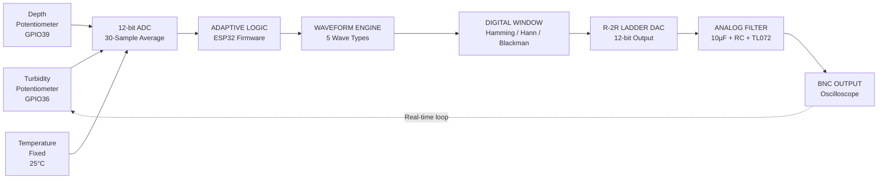
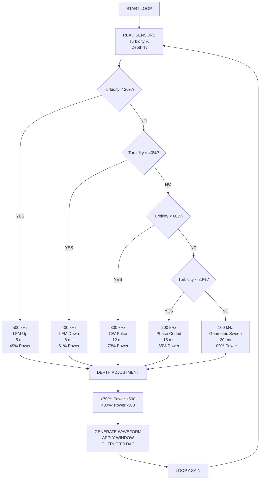
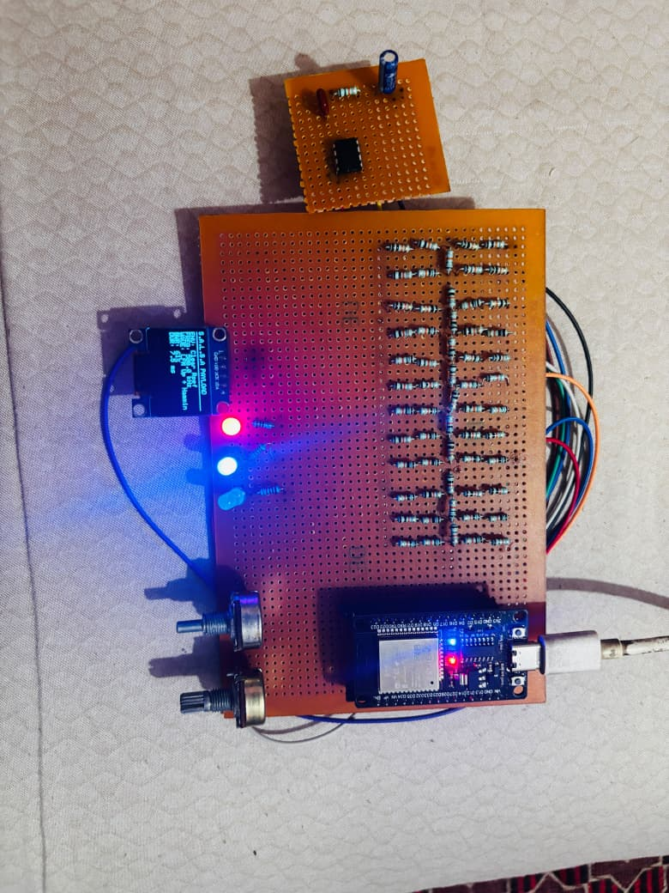

<div align="center">


# 🌊 S.A.L.S.A

### **Secure Acoustic Ledger for Subsea Autonomy**

**Adaptive Sonar Transmitter Payload for Autonomous Underwater Vehicles**

### Developed by **Team Nexora**

<br>

[](#)
[](#)
[](#)
[](#)
[](#)

<br>

**100–500 kHz**  •  **12-bit DAC**  •  **5 Waveform Types**  •  **35–80 mA**

<br>

[🌐 **View Live Deployed Website**](https://salsa-two.vercel.app/index.html)

</div>

---

# 🏆 Team Nexora

<div align="center">


### **Developed by Team Nexora**

**Team Nexora** is the team behind the design, development, prototyping, firmware, signal-processing, software, and mechanical implementation of **S.A.L.S.A — Secure Acoustic Ledger for Subsea Autonomy**.

The team combines expertise across **Computer Science & Engineering, Electronics, Telecommunication & Technology, and Mechanical Engineering** to develop an adaptive underwater acoustic transmission system for Autonomous Underwater Vehicles.

</div>

---

## 📌 Project Overview

**S.A.L.S.A is an adaptive sonar transmitter payload designed for Autonomous Underwater Vehicles (AUVs).** It dynamically adjusts acoustic waveform parameters based on real-time environmental conditions, ensuring optimal performance across diverse underwater scenarios.

The system uses a **custom R-2R ladder DAC for 12-bit resolution, multiple waveform generation, digital windowing, and a complete analog filter chain for clean signal output.**

---

## ⚡ At a Glance

| Parameter               | Specification                         |
| :---------------------- | :------------------------------------ |
| 🎯 **Application**      | Autonomous Underwater Vehicles (AUVs) |
| 📡 **Frequency Range**  | **100–500 kHz**                       |
| 🎚️ **DAC Resolution**  | **12-bit**                            |
| ⚡ **Power Draw**        | **35–80 mA**                          |
| 🌊 **Waveform Types**   | **5**                                 |
| 🪟 **Digital Windows**  | **3**                                 |
| 👥 **Development Team** | **Team Nexora**                       |

---

# 🧠 System Architecture

S.A.L.S.A follows a real-time sensing → decision → waveform generation → DAC → filtering pipeline.



---

## 🔄 Complete System Flow

```text
┌─────────────────────────────────────────────────────────────────────┐
│                        S.A.L.S.A SYSTEM FLOW                        │
└─────────────────────────────────────────────────────────────────────┘

┌───────────────┐     ┌───────────────┐     ┌───────────────┐
│  Turbidity    │     │    Depth      │     │  Temperature  │
│ Potentiometer │     │ Potentiometer │     │   (Fixed)     │
│   (GPIO36)    │     │   (GPIO39)    │     │    25°C       │
└───────┬───────┘     └───────┬───────┘     └───────┬───────┘
        │                     │                     │
        └─────────────────────┼─────────────────────┘
                              ▼
                    ┌──────────────────┐
                    │   12-bit ADC     │
                    │  30-Sample Avg   │
                    └──────────────────┘
                              │
                              ▼
                    ┌──────────────────┐
                    │  ADAPTIVE LOGIC  │
                    │  ESP32 Firmware  │
                    └──────────────────┘
                              │
                              ▼
                    ┌──────────────────┐
                    │ WAVEFORM ENGINE  │
                    │  5 Wave Types    │
                    └──────────────────┘
                              │
                              ▼
                    ┌──────────────────┐
                    │ DIGITAL WINDOW   │
                    │ Hamming/Hann/    │
                    │ Blackman         │
                    └──────────────────┘
                              │
                              ▼
                    ┌──────────────────┐
                    │  R-2R LADDER DAC │
                    │  12-bit Output   │
                    └──────────────────┘
                              │
                              ▼
                    ┌──────────────────┐
                    │  ANALOG FILTER   │
                    │ 10µF + RC + TL072│
                    └──────────────────┘
                              │
                              ▼
                    ┌──────────────────┐
                    │   BNC OUTPUT     │
                    │  Oscilloscope    │
                    └──────────────────┘
                              │
                              └────────────────┐
                                               │
                                  (Real-time loop)
```

---

# 🧩 Adaptive Decision Algorithm

S.A.L.S.A dynamically selects the operating waveform and frequency according to turbidity conditions, followed by depth-based power adjustment.



<details>
<summary><b>🔍 Detailed Adaptive Decision Flow</b></summary>

```text
┌─────────────────────────────────────────────────────────────┐
│                  ADAPTIVE DECISION ALGORITHM                │
└─────────────────────────────────────────────────────────────┘

                    ┌─────────────┐
                    │ START LOOP  │
                    └──────┬──────┘
                           ▼
                    ┌─────────────┐
                    │ READ SENSORS│
                    │ Turbidity % │
                    │ Depth %     │
                    └──────┬──────┘
                           ▼
                 ┌─────────────────┐
                 │ Turbidity < 20% │
                 └────┬───────┬────┘
                    YES       NO
                     │         │
                     ▼         ▼
              ┌────────────┐ ┌─────────────────┐
              │ 500 kHz    │ │ Turbidity < 40% │
              │ LFM Up     │ └────┬───────┬────┘
              │ 5 ms       │    YES       NO
              │ 49% Power  │     │         │
              └────────────┘     ▼         ▼
                          ┌────────────┐ ┌─────────────────┐
                          │ 400 kHz    │ │ Turbidity < 60% │
                          │ LFM Down   │ └────┬───────┬────┘
                          │ 8 ms       │    YES       NO
                          │ 61% Power  │     │         │
                          └────────────┘     ▼         ▼
                                      ┌────────────┐ ┌─────────────────┐
                                      │ 300 kHz    │ │ Turbidity < 80% │
                                      │ CW Pulse   │ └────┬───────┬────┘
                                      │ 12 ms      │    YES       NO
                                      │ 73% Power  │     │         │
                                      └────────────┘     ▼         ▼
                                                   ┌────────────┐ ┌────────────┐
                                                   │ 200 kHz    │ │ 100 kHz    │
                                                   │ Phase Coded│ │ Geometric  │
                                                   │ 15 ms      │ │ 20 ms      │
                                                   │ 85% Power  │ │ 100% Power │
                                                   └────────────┘ └────────────┘
                                                          │
                                                          ▼
                                                   ┌──────────────────┐
                                                   │ DEPTH ADJUSTMENT │
                                                   │ >70%: Power+500 │
                                                   │ <30%: Power-300 │
                                                   └──────────────────┘
                                                          │
                                                          ▼
                                                   ┌──────────────────┐
                                                   │ GENERATE WAVEFORM│
                                                   │ APPLY WINDOW     │
                                                   │ OUTPUT TO DAC    │
                                                   └──────────────────┘
                                                          │
                                                          ▼
                                                     ┌─────────────┐
                                                     │  LOOP AGAIN │
                                                     └─────────────┘
```

</details>

---

# 🌊 Waveform Engine

S.A.L.S.A supports five waveform modes optimized for different underwater conditions.

| Waveform                   |      Frequency Range      | Application             |
| :------------------------- | :-----------------------: | :---------------------- |
| **LFM Up Chirp**           | **500 kHz (Clear Water)** | High resolution imaging |
| **LFM Down Chirp**         |   **400 kHz (Moderate)**  | Balanced performance    |
| **CW Pulse**               |    **300 kHz (Muddy)**    | Continuous transmission |
| **Phase Coded (Barker-7)** |  **200 kHz (Heavy Mud)**  | Penetration mode        |
| **Geometric Sweep**        |   **100 kHz (Extreme)**   | Maximum penetration     |

---

# 🎛️ Core Features

<table>
<tr>
<td width="50%">

### 📡 Adaptive Frequency Switching

Real-time automatic selection between **100 kHz and 500 kHz** based on turbidity and depth inputs from potentiometers.

</td>

<td width="50%">

### 🔢 Custom R-2R Ladder DAC

12-bit digital-to-analog conversion using **10k and 20k (2×10k series) resistors** with perfect 2:1 ratio for accurate output.

</td>
</tr>

<tr>
<td>

### 🌊 Multi-Waveform Generation

CW, LFM Up/Down, Phase-Coded (Barker-7), and Geometric Sweep waveforms generated on-the-fly.

</td>

<td>

### 🪟 Digital Windowing

Hamming (default), Hann, and Blackman windows for sidelobe suppression and smooth pulse transitions.

</td>
</tr>

<tr>
<td>

### 🎚️ Analog Filter Chain

10µF coupling capacitor, 10kΩ+100pF RC low-pass filter, and TL072 op-amp buffer for clean signal output.

</td>

<td>

### 🔋 Low Power Design

Dynamic CPU frequency scaling (80-240 MHz) with adaptive current draw of **35-80 mA** for extended battery life.

</td>
</tr>
</table>

---

# 🧪 Prototype Development

The project evolved through multiple hardware stages, from initial R-2R ladder testing to an integrated prototype and field-deployable enclosure.

<table>
<tr>

<td align="center" width="33%">

### 🔹 Initial Prototype


**Initial Breadboard Prototype — Core ESP32 with R-2R ladder testing**

</td>

<td align="center" width="33%">

### 🔹 Prototype V2



**Prototype v2 — Integrated filter chain and OLED display**

</td>

<td align="center" width="33%">

### 🔹 3D Enclosure


**3D Printed Enclosure — Field-deployable AUV payload pod**

</td>

</tr>
</table>

---

# 🔌 Circuit Architecture

### Complete Circuit Schematic


<p align="center">
<i>Complete Circuit Schematic — ESP32, R-2R ladder, filter chain, and peripherals</i>
</p>

---

# 🧱 Hardware Architecture

The hardware platform integrates the ESP32 control and processing layer with the custom R-2R DAC, analog signal-conditioning chain, display and environmental input interfaces.

```text
                    ┌─────────────────────────┐
                    │          ESP32          │
                    │                         │
                    │  ADC Inputs             │
                    │  GPIO Waveform Output   │
                    │  Firmware / DSP         │
                    │  OLED Interface         │
                    └────────────┬────────────┘
                                 │
                                 │ 12-bit Parallel Data
                                 ▼
                    ┌─────────────────────────┐
                    │      R-2R LADDER        │
                    │          DAC            │
                    │                         │
                    │      10k / 20k          │
                    │      2:1 Ratio          │
                    └────────────┬────────────┘
                                 │
                                 ▼
                    ┌─────────────────────────┐
                    │    ANALOG FILTER        │
                    │                         │
                    │  10µF Coupling          │
                    │  10kΩ + 100pF RC        │
                    │  TL072 Buffer            │
                    └────────────┬────────────┘
                                 │
                                 ▼
                         ┌──────────────┐
                         │  BNC OUTPUT   │
                         │ Oscilloscope  │
                         └──────────────┘
```

---

# 🧮 Signal Processing Pipeline

```text
Environmental Inputs
        │
        ▼
┌────────────────────┐
│ 12-bit ADC Sampling│
│ 30-Sample Average  │
└─────────┬──────────┘
          │
          ▼
┌────────────────────┐
│ Adaptive Decision  │
│      Logic         │
└─────────┬──────────┘
          │
          ▼
┌────────────────────┐
│ Waveform Selection │
│ CW / LFM / Barker  │
└─────────┬──────────┘
          │
          ▼
┌────────────────────┐
│ Digital Windowing  │
│ Hamming / Hann /   │
│ Blackman           │
└─────────┬──────────┘
          │
          ▼
┌────────────────────┐
│   12-bit R-2R DAC  │
└─────────┬──────────┘
          │
          ▼
┌────────────────────┐
│ Analog Filtering   │
│ + Signal Buffering │
└─────────┬──────────┘
          │
          ▼
      BNC OUTPUT
```

---

# 🪟 Digital Windowing

S.A.L.S.A incorporates three digital windowing techniques:

| Window       | Role                 |
| :----------- | :------------------- |
| **Hamming**  | Default window       |
| **Hann**     | Smooth pulse shaping |
| **Blackman** | Sidelobe suppression |

These windows are applied to generated waveform samples before they are passed to the R-2R ladder DAC.

---

# 🎚️ Analog Filter Chain

The analog output stage consists of:

```text
R-2R DAC
   │
   ▼
┌─────────────────┐
│ 10µF Coupling   │
│   Capacitor     │
└────────┬────────┘
         │
         ▼
┌─────────────────┐
│ 10kΩ + 100pF    │
│ RC Low-Pass     │
│ Filter          │
└────────┬────────┘
         │
         ▼
┌─────────────────┐
│     TL072       │
│  Op-Amp Buffer  │
└────────┬────────┘
         │
         ▼
    BNC OUTPUT
```

---

# 🧰 Technology Stack

| Category                | Technology             |
| :---------------------- | :--------------------- |
| 🧠 **Microcontroller**  | ESP32 Microcontroller  |
| 🔢 **DAC**              | R-2R Ladder DAC        |
| 🎚️ **Op-Amp**          | TL072 Op-Amp           |
| 🖥️ **Display**         | SSD1306 OLED           |
| 💻 **Development**      | Arduino IDE            |
| 🧑‍💻 **Programming**   | C/C++                  |
| 🔗 **Communication**    | I2C Protocol           |
| ⚡ **GPIO**              | Parallel GPIO          |
| 📊 **Processing**       | DSP Algorithms         |
| 📡 **Waveform**         | LFM Chirp              |
| 🔐 **Phase Coding**     | Barker-7 Phase Code    |
| 🪟 **Windowing**        | Hamming Window         |
| 🔋 **Power Management** | ESP32 Power Management |

---

# ⚙️ Operating Modes

```text
                    S.A.L.S.A
                        │
          ┌─────────────┴─────────────┐
          │                           │
          ▼                           ▼
   ENVIRONMENTAL INPUTS          DEPTH INPUT
          │                           │
          └─────────────┬─────────────┘
                        ▼
                ADAPTIVE LOGIC
                        │
       ┌────────────────┼────────────────┐
       │                │                │
       ▼                ▼                ▼
   HIGH FREQ        MID RANGE        LOW FREQ
   500 kHz          300–400 kHz       100–200 kHz
       │                │                │
       ▼                ▼                ▼
   LFM CHIRP          CW / LFM       PHASE CODE /
                                  GEOMETRIC SWEEP
```

---

# 📊 System Specifications

| Specification                 | Value             |
| :---------------------------- | :---------------- |
| **Operating Frequency**       | 100–500 kHz       |
| **DAC Resolution**            | 12-bit            |
| **Waveform Types**            | 5                 |
| **Digital Windows**           | 3                 |
| **CPU Frequency Scaling**     | 80–240 MHz        |
| **Adaptive Current Draw**     | 35–80 mA          |
| **Default Temperature Input** | 25°C              |
| **ADC Sampling**              | 30-Sample Average |
| **DAC Architecture**          | R-2R Ladder       |
| **Output Interface**          | BNC               |
| **Display Interface**         | I2C               |
| **Primary Controller**        | ESP32             |
| **Development Team**          | Team Nexora       |

---

# 🚀 Development Pipeline

```text
┌──────────────────────┐
│  Concept & Research  │
└──────────┬───────────┘
           ▼
┌──────────────────────┐
│   Initial Prototype  │
│ ESP32 + R-2R Ladder  │
└──────────┬───────────┘
           ▼
┌──────────────────────┐
│   Filter Integration │
│   + OLED Interface   │
└──────────┬───────────┘
           ▼
┌──────────────────────┐
│ Adaptive DSP Engine  │
│ Waveform Generation  │
└──────────┬───────────┘
           ▼
┌──────────────────────┐
│ 3D Printed Enclosure │
└──────────┬───────────┘
           ▼
┌──────────────────────┐
│   AUV Payload Pod    │
└──────────────────────┘
```

---

# 💡 Key Innovation

### Adaptive Acoustic Transmission

Instead of operating at a fixed frequency and waveform, S.A.L.S.A dynamically selects among multiple acoustic modes based on environmental conditions.

```text
CLEAR WATER
    │
    ▼
500 kHz LFM Up
    │
    ▼
High Resolution
    │
    ▼
──────────────────────────────

MODERATE CONDITIONS
    │
    ▼
400 kHz LFM Down
    │
    ▼
Balanced Performance
    │
    ▼
──────────────────────────────

MUDDY WATER
    │
    ▼
300 kHz CW Pulse
    │
    ▼
Continuous Transmission
    │
    ▼
──────────────────────────────

HEAVY MUD
    │
    ▼
200 kHz Phase Coded
    │
    ▼
Penetration Mode
    │
    ▼
──────────────────────────────

EXTREME CONDITIONS
    │
    ▼
100 kHz Geometric Sweep
    │
    ▼
Maximum Penetration
```

---

# 🧪 Prototype Validation

The prototype demonstrates the integration of the major S.A.L.S.A subsystems:

| Module               | Prototype Status |
| :------------------- | :--------------: |
| ESP32 Control        |         ✅        |
| Environmental Input  |         ✅        |
| R-2R Ladder DAC      |         ✅        |
| Waveform Generation  |         ✅        |
| Digital Windowing    |         ✅        |
| Analog Filter Chain  |         ✅        |
| OLED Interface       |         ✅        |
| BNC Signal Output    |         ✅        |
| 3D Printed Enclosure |         ✅        |

---

# 🌐 Live Demo

<div align="center">


### **Explore S.A.L.S.A Online**

**Interactive visualization and deployed website for the S.A.L.S.A project.**

<br>

[🚀 **Visit the Live S.A.L.S.A Website**](https://salsa-two.vercel.app/index.html)

</div>

---

# 👥 Team Nexora

<div align="center">


### **TEAM NEXORA**

</div>

| Member | Role                           | Department | Responsibility                 |
| :----- | :----------------------------- | :--------: | :----------------------------- |
| **T1** | Team Lead & Firmware Architect |     CSE    | System Design & Integration    |
| **T2** | Embedded Systems Engineer      |    ET&T    | Microcontroller Programming    |
| **T3** | Signal Processing Specialist   |    ET&T    | Filter Design & DSP            |
| **T4** | Software & Simulation Engineer |     CSE    | Algorithm Development          |
| **T5** | UI/UX & Data Analyst           |     CSE    | OLED Interface & Visualization |
| **T6** | Mechanical Design Engineer     |    Mech    | Enclosure & 3D Design          |

---

# 🗂️ Project Structure

```text
S.A.L.S.A/
│
├── assets/
│   ├── Initial Prototype.jpeg
│   ├── Prototype_v2.jpeg
│   ├── 3D enclosure fabricated.jpeg
│   ├── Circuit Diagram.png
│   └── Team Logo.png
│
├── README.md
│
└── source/
    └── ...
```

---

# 🔭 System Summary

```text
                         ┌───────────────────┐
                         │  ENVIRONMENTAL    │
                         │     INPUTS        │
                         └─────────┬─────────┘
                                   │
                                   ▼
                         ┌───────────────────┐
                         │       ESP32       │
                         │  Adaptive Logic   │
                         └─────────┬─────────┘
                                   │
                                   ▼
                         ┌───────────────────┐
                         │ WAVEFORM ENGINE   │
                         │                   │
                         │  LFM ↑ / LFM ↓   │
                         │  CW / Barker-7    │
                         │  Geometric Sweep  │
                         └─────────┬─────────┘
                                   │
                                   ▼
                         ┌───────────────────┐
                         │ DIGITAL WINDOWING │
                         │ Hamming / Hann /  │
                         │     Blackman      │
                         └─────────┬─────────┘
                                   │
                                   ▼
                         ┌───────────────────┐
                         │   12-bit R-2R     │
                         │       DAC         │
                         └─────────┬─────────┘
                                   │
                                   ▼
                         ┌───────────────────┐
                         │  ANALOG FILTER    │
                         │    + TL072        │
                         └─────────┬─────────┘
                                   │
                                   ▼
                         ┌───────────────────┐
                         │    BNC OUTPUT     │
                         │    SONAR SIGNAL   │
                         └───────────────────┘
```

---

# 🌊 S.A.L.S.A

<div align="center">


### **Secure Acoustic Ledger for Subsea Autonomy**

**Developed by Team Nexora**

**Adaptive • Acoustic • Autonomous**

<br>

**Smart India Hackathon 2026**

**Robotics & Drones Theme**

<br>

[🌐 **Live Website**](https://salsa-two.vercel.app/index.html)

<br>

---

**100–500 kHz**   |   **12-bit DAC**   |   **5 Waveforms**   |   **3 Windows**   |   **35–80 mA**

<br>

*Built for adaptive underwater acoustic transmission.*

</div>

---

<div align="center">

© 2026 **Team Nexora**. All Rights Reserved.

**S.A.L.S.A Project — Smart India Hackathon 2026**

</div>
