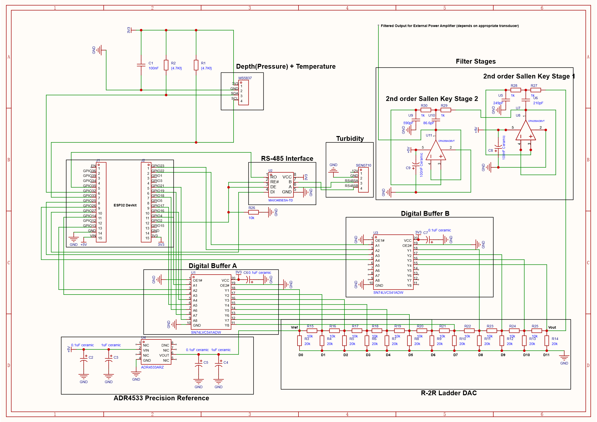
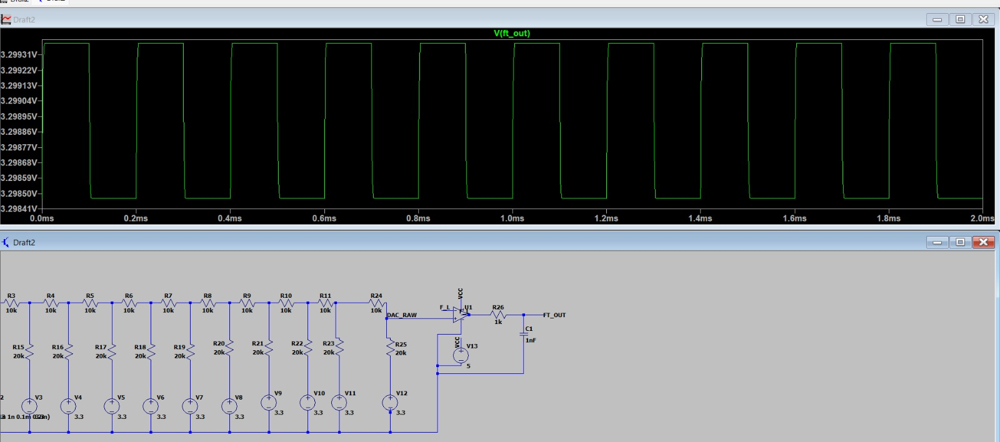

# 🌊 S.A.L.S.A

## Secure Acoustic Ledger for Subsea Autonomy

**Software-Defined Adaptive Low-Power Sonar Transmitter Payload for Autonomous Underwater Vehicles**

### Developed by Team Nexora

---

# 📌 Project Overview

**S.A.L.S.A. is a software-defined, adaptive sonar transmitter payload designed for Autonomous Underwater Vehicles (AUVs).**

Unlike a conventional transmitter that operates using a fixed waveform and transmission configuration, S.A.L.S.A. uses real-time environmental information to dynamically modify its acoustic transmission parameters.

The system follows:

```text
SENSE → ANALYSE → ADAPT → GENERATE → TRANSMIT
```

The current prototype monitors **depth, temperature, and turbidity** using dedicated underwater sensors. These parameters are processed by an **ESP32-based embedded controller**, which calculates an environmental condition value and determines suitable transmission characteristics.

The selected waveform is generated using **Direct Digital Synthesis (DDS)**, transferred through a high-speed DMA-assisted parallel interface, converted into an analog signal using a **12-bit R-2R DAC**, and conditioned through a multi-stage **OPA356 active filter** before being passed toward the external power-amplification and acoustic-transmission section.

---

# ⚡ At a Glance

| Parameter | Current Specification |
| :--- | :--- |
| 🎯 Application | Autonomous Underwater Vehicles (AUVs) |
| 📡 Frequency Range | 100–500 kHz |
| ⚡ Sampling Rate | 4 MS/s |
| 🎚️ DAC Resolution | 12-bit |
| 🔢 DDS Phase Accumulator | 32-bit |
| 🌊 Waveform Types | 5 |
| 🪟 Digital Windows | Hamming / Hann / Blackman |
| 🧮 Sine LUT | 4096 entries |
| 🌡️ Environmental Inputs | Depth / Temperature / Turbidity |
| 🔌 DAC Architecture | R-2R Ladder |
| 🧠 Controller | ESP32-WROOM-32 |
| 🔄 High-Speed Output | I2S0 Parallel + DMA |
| 🎛️ Analog Filter | Multi-stage OPA356 |
| 👥 Development Team | Team Nexora |

---

# 🧠 System Architecture

```text
Environmental Sensors
        ↓
ESP32 Environmental Analysis
        ↓
Adaptive Algorithm
        ↓
Waveform Selection
        ↓
DDS + LUT
        ↓
I2S0 Parallel + DMA
        ↓
SN74LVC541A Digital Buffers
        ↓
12-bit R-2R DAC
        ↓
OPA356 Filter Stage 1
        ↓
OPA356 Filter Stage 2
        ↓
PA Interface
        ↓
Power Amplifier
        ↓
Matching Network
        ↓
Underwater Acoustic Transducer
```

---

# 🌊 Environmental Sensing

## 🌫️ Turbidity — SEN0710

The **DFRobot SEN0710 industrial turbidity sensor** provides underwater turbidity measurements.

The sensor communicates with the ESP32 through **RS-485 Modbus RTU** using a **MAX3485E** transceiver.

```text
SEN0710
   │ RS-485
   ▼
MAX3485E
   │ UART
   ▼
ESP32
```

| Parameter | Specification |
| :--- | :--- |
| Measurement Range | 0–1000 NTU |
| Interface | RS-485 |
| Protocol | Modbus RTU |
| Supply | 10–30 V |
| Protection | IP68 |

## 🌊 Depth + Temperature — MS5837-30BA

The **MS5837-30BA** provides pressure-based depth information together with temperature measurement through **I2C**.

```text
MS5837-30BA
      │
      ├── SDA → ESP32 GPIO32
      └── SCL → ESP32 GPIO33
```

---

# 🔌 RS-485 Interface

```text
                 MAX3485E

SEN0710 A ───────── A
SEN0710 B ───────── B

RO ───────────────── ESP32 RX
DI ───────────────── ESP32 TX

DE + /RE ─────────── ESP32 Direction Control
```

This provides a differential communication interface between the underwater sensor and embedded controller.

---

# 🧩 Adaptive Decision Algorithm

The prototype considers:

```text
Turbidity
    +
Depth
    +
Temperature Stress
    ↓
Environmental Condition E
    ↓
Adaptive Transmission Parameters
```

A representative prototype model is:

```text
E = 0.45 × Turbidityₙ
  + 0.30 × Depthₙ
  + 0.25 × TemperatureStress
```

The resulting environmental condition is used to modify:

- Frequency
- Bandwidth
- Centre frequency
- Pulse duration
- Signal amplitude
- Waveform type

> Note: The current adaptive relationship is a prototype heuristic intended for demonstration and experimental validation. It is not presented as a universal underwater acoustic propagation law.

---

# 🎛️ Adaptive Transmission

The prototype dynamically modifies the waveform according to the calculated environmental condition.

```text
LOW E        → Wider bandwidth / higher-frequency operation
MEDIUM E     → Moderate adaptive configuration
HIGH E       → Narrower bandwidth / lower centre-frequency operation
```

---

# 🌊 Waveform Engine

| Waveform | Description |
| :--- | :--- |
| **LFM Up-Chirp** | Frequency increases throughout the pulse |
| **LFM Down-Chirp** | Frequency decreases throughout the pulse |
| **CW Pulse** | Fixed-frequency sinusoidal pulse |
| **Barker-7** | Phase-coded waveform |
| **Geometric Sweep** | Non-linear frequency sweep |

### Barker-7 Sequence

```text
+1   +1   +1   -1   -1   +1   -1
```

---

# 📡 Frequency & Bandwidth Adaptation

The prototype operates across:

```text
100 kHz ─────────────────────────────── 500 kHz
```

A representative adaptive model is:

```text
Bandwidth = 400 kHz − 300 kHz × E

Centre Frequency = 300 kHz − 100 kHz × E
```

At low environmental condition:

```text
E ≈ 0
Operating Band ≈ 100–500 kHz
```

At high environmental condition:

```text
E ≈ 1
Operating Band ≈ 150–250 kHz
```

These values demonstrate the software-controlled adaptation mechanism and can be refined through future underwater experiments.

---

# 🧮 Direct Digital Synthesis

S.A.L.S.A. generates its waveform using **Direct Digital Synthesis (DDS)**.

```text
32-bit Phase Accumulator
        +
4096-entry Sine LUT
        +
4 MS/s Sampling Rate
        ↓
Digital Waveform Samples
```

The phase increment is:

```text
ΔP = (f / fs) × 2³²
```

For example:

```text
f  = 500 kHz
fs = 4 MHz

ΔP = 536,870,912
```

This allows precise digital frequency control without continuously calculating trigonometric functions.

---

# 🪟 Digital Windowing

S.A.L.S.A. supports:

| Window | Purpose |
| :--- | :--- |
| **Hamming** | Default waveform window |
| **Hann** | Smooth pulse shaping |
| **Blackman** | Stronger sidelobe suppression |

---

# ⚡ High-Speed DAC Output

```text
Waveform Buffer
      ↓
DMA Engine
      ↓
I2S0 Parallel
      ↓
SN74LVC541A
      ↓
12-bit R-2R DAC
```

The target digital sample rate is **4 MS/s**.

---

# 🔢 12-bit R-2R DAC

The prototype uses a discrete **12-bit R-2R ladder DAC**.

```text
R  = 10 kΩ
2R = 20 kΩ
```

Ideal relationship:

```text
VOUT = VREF × CODE / 4096
```

With a 3.3 V reference:

```text
Ideal LSB ≈ 0.806 mV
```

The digital bits are driven through **SN74LVC541A** buffers.

---

# 🎯 Precision DAC Reference — ADR4533

The R-2R DAC uses an **ADR4533 precision 3.3 V voltage reference**.

```text
+5V Analog
    ↓
ADR4533
    ↓
DAC_VREF
    ↓
R-2R Ladder
```

Local bypass capacitors support reference stability and noise performance.

---

# 🎚️ Analog Filter Chain

The raw DAC output is passed through two active filter stages using **OPA356**.

```text
12-bit R-2R DAC
       ↓
OPA356 Stage 1
R1 = 1 kΩ
R2 = 1 kΩ
C1 = 249 pF
C2 = 210 pF
       ↓
OPA356 Stage 2
R3 = 1 kΩ
R4 = 1 kΩ
C3 = 590 pF
C4 = 86.6 pF
       ↓
FILTER_OUT
```

The filter stages condition the DAC waveform and suppress unwanted high-frequency components.

---

# 🔌 Power Amplifier Interface

The filtered waveform is not intended to directly drive the underwater transducer.

```text
FILTER_OUT
    ↓
PA INPUT
    ↓
POWER AMPLIFIER
    ↓
MATCHING NETWORK
    ↓
UNDERWATER TRANSDUCER
```

The exact amplifier and matching network depend on the selected transducer's impedance, resonance, capacitance, voltage and power requirements.

---

# 🔌 Complete Circuit Schematic

<div align="center">



<i>Complete S.A.L.S.A. hardware schematic.</i>

</div>

---

# 📈 Waveform Output

<div align="center">



<i>S.A.L.S.A. waveform output demonstrating the generated sonar signal.</i>

</div>

---

# 🧱 Hardware Architecture

```text
ESP32
  │
  ├── Environmental Sensing
  ├── Adaptive Algorithm
  ├── DDS + LUT
  └── I2S0 + DMA
          ↓
SN74LVC541A
          ↓
12-bit R-2R DAC
          ↓
OPA356 Filter 1
          ↓
OPA356 Filter 2
          ↓
PA Interface
          ↓
Power Amplifier
          ↓
Matching Network
          ↓
Underwater Transducer
```

---

# 🧠 Firmware Architecture

```text
SALSA-Firmware/
│
├── CMakeLists.txt
├── sdkconfig.defaults
│
└── main/
    ├── main.cpp
    ├── config.h
    ├── ms5837.h
    ├── ms5837.cpp
    ├── sen0710.h
    ├── sen0710.cpp
    ├── adaptive.h
    ├── adaptive.cpp
    ├── dds.h
    ├── dds.cpp
    ├── waveform.h
    ├── waveform.cpp
    ├── dac_parallel.h
    └── dac_parallel.cpp
```

---

# ⚙️ Firmware Processing Flow

```text
INITIALIZE SYSTEM
       ↓
INITIALIZE SENSORS
       ↓
INITIALIZE DDS + LUT
       ↓
INITIALIZE I2S0 + DMA
       ↓
READ ENVIRONMENT
       ↓
CALCULATE ENVIRONMENTAL CONDITION
       ↓
SELECT WAVEFORM
       ↓
CALCULATE DDS PARAMETERS
       ↓
GENERATE SAMPLES
       ↓
APPLY WINDOW
       ↓
DMA → I2S0
       ↓
12-bit R-2R DAC
       ↓
ANALOG FILTER
       ↓
PA / TRANSDUCER
       ↓
REPEAT
```

---

# 🧰 Technology Stack

| Category | Technology |
| :--- | :--- |
| Microcontroller | ESP32-WROOM-32 |
| Firmware | C/C++ |
| Development | ESP-IDF |
| Waveform Generation | DDS |
| Sine LUT | 4096 Entries |
| Sample Rate | 4 MS/s |
| High-Speed Interface | I2S0 Parallel + DMA |
| DAC | 12-bit R-2R Ladder |
| DAC Reference | ADR4533 |
| Digital Buffer | SN74LVC541A |
| Analog Amplifier | OPA356 |
| Depth Sensor | MS5837-30BA |
| Turbidity Sensor | DFRobot SEN0710 |
| RS-485 Transceiver | MAX3485E |
| Sensor Communication | I2C + RS-485 Modbus RTU |
| Signal Processing | Embedded DSP |
| Waveforms | LFM / CW / Barker-7 / Geometric |
| Windowing | Hamming / Hann / Blackman |

---

# 📊 System Specifications

| Specification | Current Design |
| :--- | :--- |
| Operating Frequency | 100–500 kHz |
| Sampling Rate | 4 MS/s |
| DAC Resolution | 12-bit |
| DDS Phase Accumulator | 32-bit |
| Sine Lookup Table | 4096 entries |
| Waveform Types | 5 |
| Window Functions | 3 |
| Environmental Inputs | Depth / Temperature / Turbidity |
| Depth Interface | I2C |
| Turbidity Interface | RS-485 Modbus RTU |
| DAC Architecture | R-2R |
| DAC Resistors | 10 kΩ / 20 kΩ |
| DAC Reference | ADR4533 3.3 V |
| Digital Buffer | SN74LVC541A |
| Analog Filter | Two-stage OPA356 |
| High-Speed Output | I2S0 Parallel + DMA |
| Primary Controller | ESP32 |
| External PA | Modular |
| Acoustic Transducer | Modular |
| Development Team | Team Nexora |

---

# 🧪 Current Prototype Validation

| Module | Status |
| :--- | :---: |
| ESP32 Control | ✅ |
| MS5837 Depth Interface | ✅ |
| MS5837 Temperature Interface | ✅ |
| SEN0710 Turbidity Interface | ✅ |
| MAX3485E RS-485 Interface | ✅ |
| Adaptive Processing | ✅ |
| DDS Waveform Generation | ✅ |
| 4096-Entry Sine LUT | ✅ |
| 32-bit Phase Accumulator | ✅ |
| I2S0 Parallel Output | ✅ |
| DMA-Based Sample Transfer | ✅ |
| 12-bit R-2R DAC | ✅ |
| ADR4533 Precision Reference | ✅ |
| SN74LVC541A Buffering | ✅ |
| OPA356 Filter Stage 1 | ✅ |
| OPA356 Filter Stage 2 | ✅ |
| Waveform Output | ✅ |
| External Power Amplifier | Modular |
| Matching Network | Modular |
| Underwater Transducer | Future Integration |

---

# 💡 Key Innovation

S.A.L.S.A. moves beyond a fixed waveform transmitter by making transmission parameters software-controlled and environmentally aware.

```text
UNDERWATER ENVIRONMENT
          ↓
DEPTH / TEMPERATURE / TURBIDITY
          ↓
ENVIRONMENTAL CONDITION ANALYSIS
          ↓
ADAPTIVE PARAMETERS
          ↓
SOFTWARE-DEFINED WAVEFORM ENGINE
          ↓
ANALOG TRANSMISSION
```

The system connects real-time environmental measurements with physical acoustic waveform generation, creating a flexible platform for adaptive underwater transmission research.

---

# 🔭 Future Development

Future development can include:

- Experimental underwater validation
- Integration with an actual underwater transducer
- Power amplifier optimisation
- Transducer-specific impedance matching
- Closed-loop acoustic feedback
- Salinity and conductivity sensing
- Ambient acoustic noise measurement
- Adaptive received-signal analysis
- More advanced waveform optimisation
- Data-driven adaptive algorithms
- FPGA/DSP-based high-performance implementation
- Higher-speed precision DAC
- Full AUV payload integration
- Autonomous mission-level control

A future closed-loop architecture could evolve toward:

```text
ENVIRONMENT
     ↓
SENSING
     ↓
ADAPTIVE TRANSMISSION
     ↓
ACOUSTIC SIGNAL
     ↓
TARGET / ENVIRONMENT
     ↓
RECEIVED ECHO
     ↓
SIGNAL QUALITY ANALYSIS
     ↓
NEXT TRANSMISSION
```

---

# 👥 Team Nexora

| Member | Role | Department | Responsibility |
| :---: | :--- | :---: | :--- |
| Mayukh Mondal | Team Lead & Firmware Architect | CSE | System Design & Integration |
| Bhavya Kumari | Embedded Systems Engineer | ET&T | Microcontroller & Embedded Development |
| Kashish Shariff | Signal Processing Specialist | ET&T | Filter Design & DSP |
| Omkar Sahu | Software & Simulation Engineer | CSE | Algorithm Development |
| Kanak Narware | UI/UX & Data Analyst | CSE | Visualization & Data Presentation |
| Shubham Mishra | Mechanical Design Engineer | Mech | Mechanical Design & Integration |

---

# 🗂️ Project Structure

```text
S.A.L.S.A/
│
├── assets/
│   ├── SCH_Schematic1_1-P1_2026-09-20.png
│   ├── Wavform_Output.jpeg
│   └── Team Logo.png
│
├── main/
│   ├── main.cpp
│   ├── config.h
│   ├── ms5837.cpp
│   ├── ms5837.h
│   ├── sen0710.cpp
│   ├── sen0710.h
│   ├── adaptive.cpp
│   ├── adaptive.h
│   ├── dds.cpp
│   ├── dds.h
│   ├── waveform.cpp
│   ├── waveform.h
│   ├── dac_parallel.cpp
│   └── dac_parallel.h
│
├── README.md
│
└── source/
    └── ...
```

---

# ▶️ S.A.L.S.A. Project Video

<div align="center">

<a href="https://youtu.be/eq3fUiAaMew">


</a>

### **▶ Watch the S.A.L.S.A. Project Video**

**100–500 kHz | 12-bit DAC | 4 MS/s | 5 Waveforms**

*Built for adaptive underwater acoustic transmission.*

</div>

---

<div align="center">

## 🌊 S.A.L.S.A.

### Secure Acoustic Ledger for Subsea Autonomy

**Developed by Team Nexora**

**Adaptive • Acoustic • Autonomous**

**Smart India Hackathon 2026**

**Robotics & Drones Theme**

</div>
